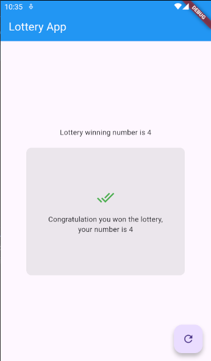
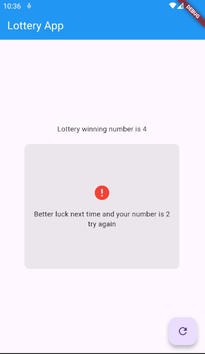

# 🎲 Flutter Lottery App

A simple Flutter application that demonstrates random number generation and basic state management using `setState()`. The app generates a random number when the user presses the refresh button and checks whether it matches the predefined winning number.

> **Note:** This project is built for learning Flutter fundamentals. It does not use APIs, databases, or external packages.

---

## ✨ Features

- Random number generation using Dart's `Random` class
- Fixed winning number comparison
- Displays a winning or losing message based on the generated number
- Uses `FloatingActionButton` to generate a new number
- Visual feedback with Material Icons
- Beginner-friendly Flutter project

---

## 📸 Screenshot

<p>
  
</p>

<p>
  
</p>

---

## 🛠 Built With

- Flutter
- Dart
- Material Design

---

## 📂 Project Structure

```
flutter-lottery-app/
│
├── android/                # Android platform-specific files
├── ios/                    # iOS platform-specific files
├── linux/                  # Linux platform-specific files
├── macos/                  # macOS platform-specific files
├── web/                    # Web platform-specific files
├── windows/                # Windows platform-specific files
│
├── assets/
│   └── screenshots/
│       └── flutter-lottery-app.png
├── lib/
│   └── main.dart           # Main application source code
│
├── test/                   # Widget tests
│
├── .gitignore
├── .metadata
├── analysis_options.yaml
├── pubspec.yaml            # Project dependencies and configuration
├── pubspec.lock            # Locked dependency versions
└── README.md               # Project documentation
```

---

## 🚀 Getting Started

### Prerequisites

- Flutter SDK
- Dart SDK
- Android Studio or VS Code
- Android Emulator or Physical Device

### Installation

1. Clone the repository

```bash
git clone https://github.com/your-username/flutter-lottery-app.git
```

2. Navigate to the project directory

```bash
cd flutter-lottery-app
```

3. Install dependencies

```bash
flutter pub get
```

4. Run the application

```bash
flutter run
```

---

## 🎯 How It Works

- The application has a predefined winning number (`4`).
- Press the **Refresh** floating action button to generate a random number.
- If the generated number matches the winning number, a congratulatory message is displayed.
- Otherwise, the app displays a "Better luck next time" message.

---

## 📚 Concepts Practiced

- Stateful Widgets
- `setState()`
- Random number generation
- Conditional UI rendering
- Material Design widgets
- Flutter layouts using `Column`, `Container`, and `Center`

---

## 🔮 Future Improvements

- Allow users to choose the winning number
- Display the number generation history
- Add animations for winning and losing states
- Improve the user interface
- Add sound effects
- Include score tracking and statistics

---

## 📦 Dependencies

This project uses only Flutter's built-in Material package and Dart's `dart:math` library. No third-party packages are required.

---

## 👨‍💻 Author

**Ahmed Dawood**

Software Engineering Student

---

## 📄 License

This project is intended for educational and learning purposes.